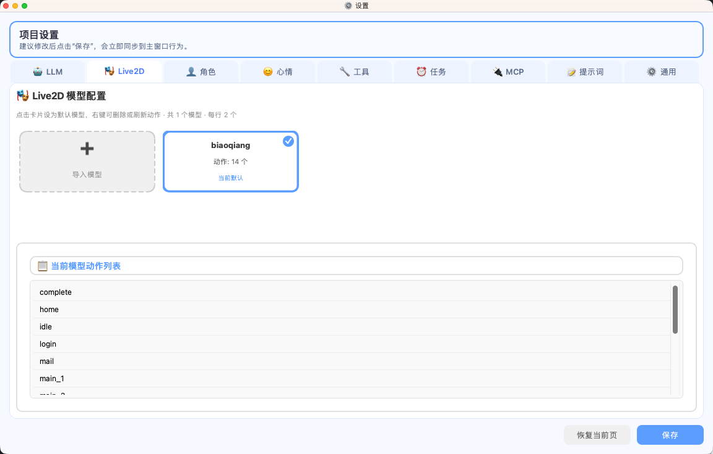
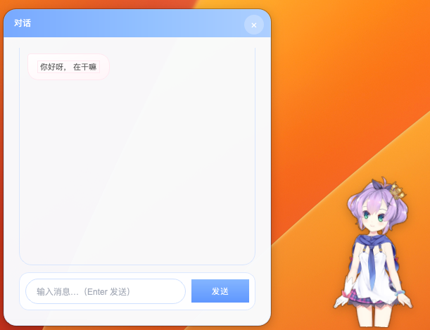
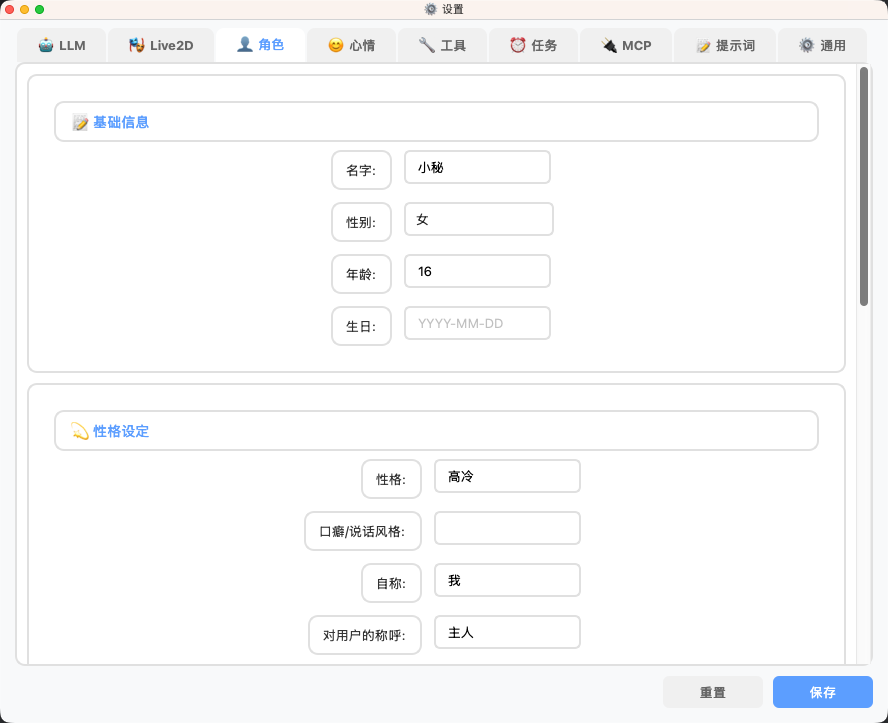
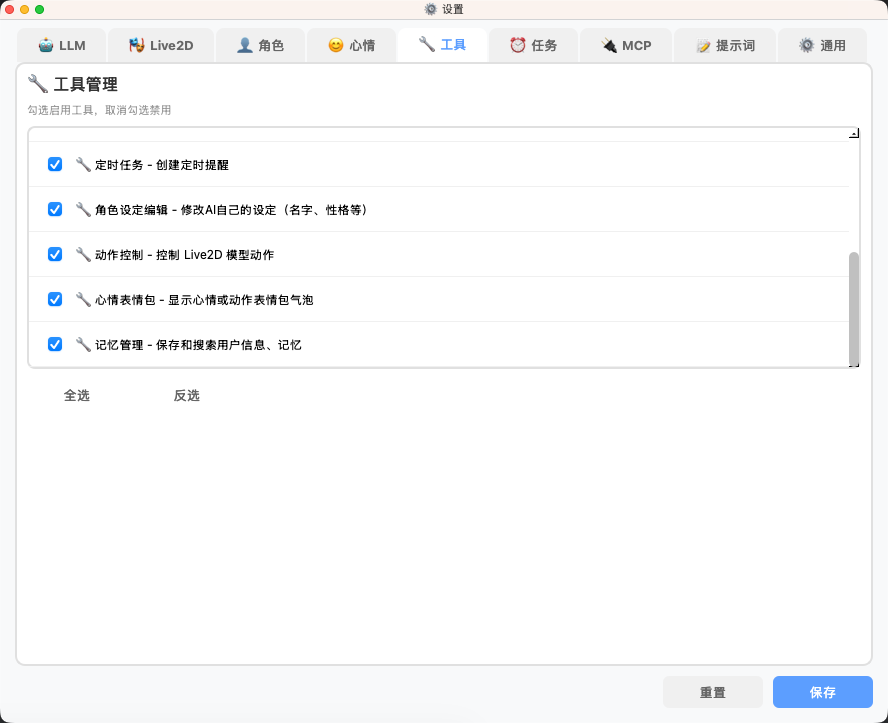
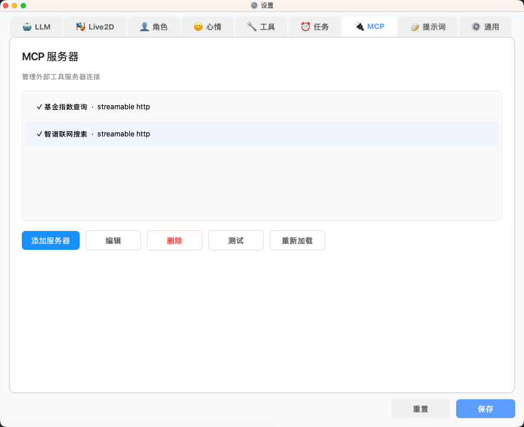
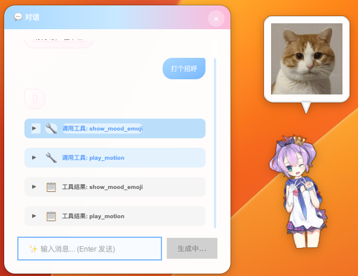

# Kizuna - 二次元桌面助手

<div align="center">

一个可常驻桌面的 Live2D AI 助手：会聊天、会记忆、可配置角色、可调用工具。 

使用CLaude Code 与 CodeBuddy开发

[](https://www.python.org/)
[](#)
[](LICENSE)

</div>

---

## 亮点功能

- Live2D 桌宠展示（`model3.json`）
- 点击/拖拽交互，心情驱动动作
- AI 对话（支持 `OpenAI / Ollama`）
- 角色设定、系统提示词可视化配置
- 内置工具 + MCP 扩展
- 定时任务、待办与历史记录
- 系统托盘常驻（macOS 支持隐藏 Dock）

---

## 截图展示

<div align="center">

### 主界面


### AI 对话


### 设置页面

| Live2D 模型管理 | 角色设定 |
|:--:|:--:|
|  |  |

| 技能配置 | MCP 服务器 |
|:--:|:--:|
|  |  |

### 表情气泡


</div>

---

## 快速开始

```bash
git clone https://github.com/zclvct/Kizuna.git
cd Kizuna

python -m venv .venv
source .venv/bin/activate      # macOS/Linux
# .venv\Scripts\activate      # Windows

pip install -r requirements.txt
python run.py
```

---

## 基本配置

应用首次启动会将运行数据初始化到用户目录：

- macOS / Linux：`~/Kizuna`
- Windows：`%USERPROFILE%\\Kizuna`

常用配置文件：

- `~/Kizuna/data/config.json`（LLM / Live2D / 通用设置）
- `~/Kizuna/data/character.json`（角色设定）
- `~/Kizuna/data/tools.json`（工具开关）
- `~/Kizuna/data/mcp_servers.json`（MCP 服务器）

`config.json` 示例：

```json
{
  "llm": {
    "provider": "ollama",
    "model": "qwen3.5:4B",
    "base_url": "http://localhost:11434"
  },
  "live2d": {
    "model_path": "assets/live2d/biaoqiang"
  }
}
```

---

## 技术栈

- `PySide6`
- `QWebEngine`
- `pixi-live2d-display`（本地资源）
- `LangChain`

> 当前渲染方案为 **WebEngine Live2D**，不依赖 `live2d-py` / `PyOpenGL`。

---

## License

MIT，详见 `LICENSE`。