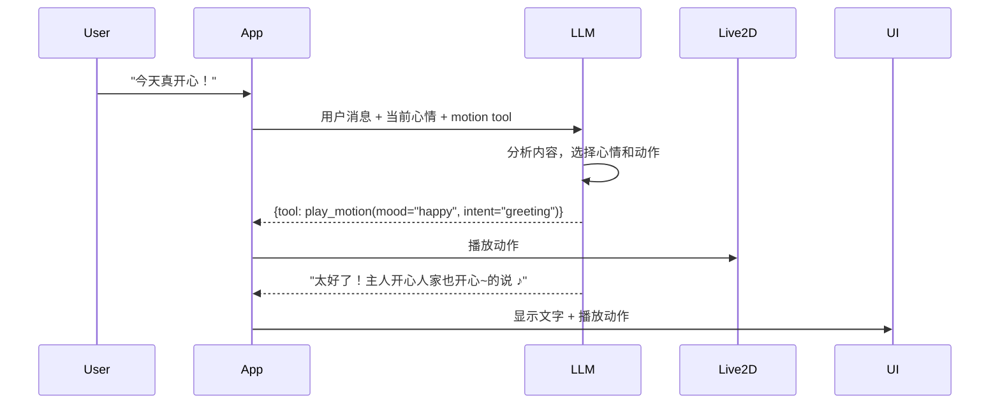

# Live2D 心情与动作系统设计

## 1. 功能概述

### 1.1 设计目标
在对话过程中，LLM 可以根据对话内容、当前"心情"自动选择并触发合适的 Live2D 动作和表情，让角色更加生动有灵魂。

### 1.2 核心特性
- **心情状态追踪**：角色有心情值（开心/普通/难过/害羞/生气等）
- **对话内容分析**：LLM 根据对话内容判断应该做什么动作
- **动作映射系统**：将心情/意图映射到 Live2D 动作 ID
- **自动触发**：回复时自动播放对应动作

---

## 2. 数据结构设计

### 2.1 心情状态 (Mood)

```python
from enum import Enum

class Mood(Enum):
    """心情枚举"""
    HAPPY = "happy"          # 开心
    EXCITED = "excited"      # 兴奋
    NORMAL = "normal"        # 普通/平静
    SHY = "shy"              # 害羞
    SAD = "sad"              # 难过
    ANGRY = "angry"          # 生气
    SURPRISED = "surprised"  # 惊讶
    THINKING = "thinking"    # 思考中
```

### 2.2 动作映射配置

`data/motions.json` - 动作映射配置文件：

```json
{
  "model_id": "default_model",
  "mood_motions": {
    "happy": ["motion_happy_01", "motion_happy_02", "motion_laugh"],
    "excited": ["motion_excited_01", "motion_jump"],
    "normal": ["motion_idle_01", "motion_idle_02", "motion_blink"],
    "shy": ["motion_shy_01", "motion_look_away"],
    "sad": ["motion_sad_01", "motion_down"],
    "angry": ["motion_angry_01", "motion_pout"],
    "surprised": ["motion_surprised_01", "motion_eyes_wide"],
    "thinking": ["motion_thinking_01", "motion_look_up"]
  },
  "intent_motions": {
    "greeting": ["motion_wave", "motion_smile"],
    "agree": ["motion_nod", "motion_smile"],
    "disagree": ["motion_shake_head", "motion_pout"],
    "thinking": ["motion_thinking_01", "motion_look_up"],
    "apologize": ["motion_apologize_01", "motion_bow"],
    "thank": ["motion_thank_01", "motion_bow_slight"]
  },
  "idle_motions": ["motion_idle_01", "motion_idle_02"],
  "default_motion": "motion_idle_01"
}
```

### 2.3 角色状态追踪

```python
from pydantic import BaseModel
from typing import Optional, List
from datetime import datetime

class CharacterState(BaseModel):
    """角色状态"""
    # 当前心情
    current_mood: str = "normal"
    mood_history: List[dict] = []

    # 动作状态
    current_motion: Optional[str] = None
    is_motion_playing: bool = False
    last_motion_time: Optional[datetime] = None

    # 空闲动作定时器
    idle_timer_enabled: bool = True
    idle_interval: int = 30  # 秒

    def update_mood(self, new_mood: str, reason: str = ""):
        """更新心情"""
        old_mood = self.current_mood
        self.current_mood = new_mood

        self.mood_history.append({
            "old": old_mood,
            "new": new_mood,
            "reason": reason,
            "timestamp": datetime.utcnow().isoformat()
        })

        # 只保留最近 50 条记录
        if len(self.mood_history) > 50:
            self.mood_history = self.mood_history[-50:]
```

---

## 3. 工作流程

### 3.1 完整对话流程



### 3.2 LLM 动作决策

给 LLM 提供的 System Prompt 补充：

```
你是一个 Live2D 角色助手，你可以通过动作来表达情绪。

在回复时，你可以调用 play_motion 工具来播放动作。请根据：
1. 当前对话内容 - 决定用什么动作
2. 当前心情 - 从 mood 选项中选择
3. 对话意图 - 从 intent 选项中选择

可用的 mood: happy, excited, normal, shy, sad, angry, surprised, thinking
可用的 intent: greeting, agree, disagree, thinking, apologize, thank

请优先使用 intent，如果没有合适的 intent 则使用 mood。
先调用 tool 播放动作，再回复文字。
```

### 3.3 Function Calling 工具定义

```python
MOTION_TOOL = {
    "type": "function",
    "function": {
        "name": "play_motion",
        "description": "播放 Live2D 动作/表情，表达情绪。在回复文字前调用。",
        "parameters": {
            "type": "object",
            "properties": {
                "mood": {
                    "type": "string",
                    "enum": ["happy", "excited", "normal", "shy", "sad", "angry", "surprised", "thinking"],
                    "description": "心情类型，根据对话内容选择"
                },
                "intent": {
                    "type": "string",
                    "enum": ["greeting", "agree", "disagree", "thinking", "apologize", "thank", ""],
                    "description": "对话意图，可选，优先于 mood"
                },
                "motion_id": {
                    "type": "string",
                    "description": "直接指定动作 ID，可选，不指定则自动选择"
                },
                "new_mood": {
                    "type": "string",
                    "enum": ["happy", "excited", "normal", "shy", "sad", "angry", "surprised", "thinking"],
                    "description": "更新角色心情，可选"
                }
            },
            "required": []
        }
    }
}
```

---

## 4. 动作控制器设计

### 4.1 MotionController 类

```python
# src/live2d/motion_controller.py
import random
from typing import Optional, List
from pathlib import Path
import json

class MotionController:
    """Live2D 动作控制器"""

    def __init__(self, model, config_path: Path):
        self.model = model
        self.config = self._load_config(config_path)
        self.current_state = CharacterState()
        self._callbacks = []

    def _load_config(self, path: Path) -> dict:
        """加载动作配置"""
        if path.exists():
            return json.loads(path.read_text(encoding="utf-8"))
        return self._default_config()

    def _default_config(self) -> dict:
        return {
            "mood_motions": {"normal": ["idle"]},
            "intent_motions": {},
            "idle_motions": ["idle"],
            "default_motion": "idle"
        }

    def get_motion_for_mood(self, mood: str) -> Optional[str]:
        """根据心情获取随机动作"""
        motions = self.config["mood_motions"].get(mood, [])
        if motions:
            return random.choice(motions)
        return self.config["default_motion"]

    def get_motion_for_intent(self, intent: str) -> Optional[str]:
        """根据意图获取随机动作"""
        motions = self.config["intent_motions"].get(intent, [])
        if motions:
            return random.choice(motions)
        return None

    def play_motion(
        self,
        mood: Optional[str] = None,
        intent: Optional[str] = None,
        motion_id: Optional[str] = None,
        new_mood: Optional[str] = None
    ):
        """播放动作"""
        # 更新心情
        if new_mood:
            self.current_state.update_mood(new_mood, reason="llm_update")
        elif mood and not intent:
            self.current_state.update_mood(mood, reason="mood_action")

        # 选择动作
        if motion_id:
            final_motion = motion_id
        elif intent:
            final_motion = self.get_motion_for_intent(intent)
            if not final_motion and mood:
                final_motion = self.get_motion_for_mood(mood)
        elif mood:
            final_motion = self.get_motion_for_mood(mood)
        else:
            final_motion = self.config["default_motion"]

        # 播放
        if final_motion:
            self._play(final_motion)

    def _play(self, motion_id: str):
        """实际播放动作"""
        self.current_state.current_motion = motion_id
        self.current_state.is_motion_playing = True
        self.current_state.last_motion_time = datetime.utcnow()

        # 调用 Live2D 模型播放动作
        if self.model:
            self.model.start_motion(motion_id)

        # 通知回调
        for cb in self._callbacks:
            cb(motion_id)

    def on_motion_end(self):
        """动作播放结束回调"""
        self.current_state.is_motion_playing = False

    def play_idle(self):
        """播放空闲动作"""
        if self.current_state.idle_timer_enabled:
            motion = random.choice(self.config["idle_motions"])
            self._play(motion)
```

---

## 5. 对话中的动作触发

### 5.1 消息处理流程

```python
# src/chat/chat_manager.py
from typing import List, Dict

class ChatManager:
    """对话管理器"""

    def __init__(self, llm_client, motion_controller):
        self.llm_client = llm_client
        self.motion_controller = motion_controller
        self.messages: List[Dict] = []

    async def send_message(self, user_text: str) -> str:
        """发送用户消息并获取回复"""
        # 添加用户消息
        self.messages.append({"role": "user", "content": user_text})

        # 构建 system prompt (包含当前心情)
        system_prompt = self._build_system_prompt()

        # 准备 tools (包含 play_motion)
        tools = self._get_tools()

        # 调用 LLM
        response = await self.llm_client.chat(
            messages=[{"role": "system", "content": system_prompt}] + self.messages,
            tools=tools,
            stream=False
        )

        # 处理 tool calls (播放动作)
        assistant_text = await self._process_response(response)

        # 添加助手消息
        self.messages.append({"role": "assistant", "content": assistant_text})

        return assistant_text

    def _build_system_prompt(self) -> str:
        """构建包含心情的 System Prompt"""
        persona = get_character_persona()
        mood = self.motion_controller.current_state.current_mood

        base = persona.to_system_prompt()
        mood_info = f"\n\n你当前的心情是：{mood}"
        motion_instruction = """

你可以使用 play_motion 工具来播放动作表达情绪。
请在回复文字前先调用 tool 播放动作。
"""
        return base + mood_info + motion_instruction

    async def _process_response(self, response):
        """处理 LLM 响应，执行 tool calls"""
        message = response.choices[0].message

        # 如果有 tool calls
        if hasattr(message, 'tool_calls') and message.tool_calls:
            for tool_call in message.tool_calls:
                if tool_call.function.name == "play_motion":
                    args = json.loads(tool_call.function.arguments)
                    self.motion_controller.play_motion(**args)

            # 获取最终回复 (需要再调用一次 LLM 或看返回)
            # ...

        return message.content or ""
```

---

## 6. 设置界面扩展

### 6.1 Live2D 设置标签页新增

```
┌─────────────────────────────────────────┐
│  Live2D 设置                             │
├─────────────────────────────────────────┤
│                                         │
│  模型选择: [默认模型    ▼] [浏览...]    │
│  角色缩放: [======= 100% =====]       │
│                                         │
│  ───────────────────────────────────   │
│                                         │
│  动作设置                              │
│  ☑ 启用心情驱动动作                    │
│  ☑ 启用空闲动作 (每 [30] 秒)          │
│  ☑ 对话时自动播放动作                  │
│                                         │
│  动作映射配置 [编辑...]                 │
│                                         │
│  [测试动作]                             │
│  心情: [开心    ▼] [播放]             │
│  意图: [问候    ▼] [播放]             │
│                                         │
│  [保存]                                 │
└─────────────────────────────────────────┘
```

---

## 7. 交互示例

### 示例 1：开心的对话
```
用户：今天发工资了！超开心！
(LLM 分析：用户很开心，应该用 happy 心情)
(后台：play_motion(mood="happy", new_mood="happy"))
(Live2D：播放开心跳跃的动作)

角色：哇！太棒了~的说！恭喜主人！♪
(Live2D：继续开心的表情)
```

### 示例 2：道歉
```
用户：不好意思，刚才让你久等了
(LLM 分析：用户在道歉，我应该礼貌回应)
(后台：play_motion(intent="apologize"))
(Live2D：微微低头的动作)

角色：没关系的主人，人家随时都在~的说
```

### 示例 3：思考中
```
用户：你说我今天穿什么好呢？
(LLM 分析：需要思考一下)
(后台：play_motion(mood="thinking"))
(Live2D：手托下巴思考的动作)

角色：嗯...让人家想想~
(停顿片刻)
(Live2D：眼睛一亮)
角色：今天天气不错，穿那件白色的连衣裙怎么样？主人穿肯定超可爱！
```

---

## 8. 动作映射配置工具

提供一个简单的配置工具让用户自定义动作映射：

```python
# src/app/motion_config_window.py
```

允许用户：
- 为每个心情分配动作
- 为每个意图分配动作
- 测试播放每个动作
- 导入/导出动作配置
