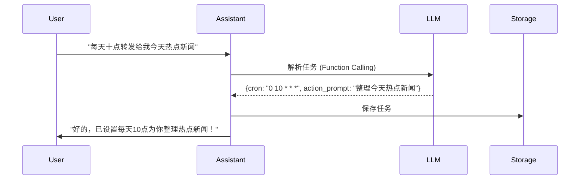

# 二次元桌面助手 - 功能说明书

## 1. 项目概述

### 1.1 项目目标
创建一个基于 Live2D 角色的二次元桌面助手，具备 AI 对话、工具助手和智能定时任务功能，在桌面常驻运行。

### 1.2 核心特性
- Live2D 角色桌面常驻，支持拖拽移动
- **心情驱动动作**：LLM 根据对话内容和心情自动选择 Live2D 动作
- AI 多轮对话，支持多 LLM 后端
- **可定制角色设定**：用户可自由编辑角色人格、对话风格
- **动态记忆成长**：LLM 可在对话中学习并记住用户信息
- **技能开关**：用户可手动配置启用哪些助手能力
- 丰富的助手工具集
- 自然语言设置定时任务，LLM 自动解析

---

## 2. 技术架构

### 2.1 技术栈

| 层级 | 技术选型 | 说明 |
|------|----------|------|
| 桌面框架 | PySide6 (Qt6) | 跨平台 GUI，支持 OpenGL |
| Live2D 渲染 | OpenGL + Live2D Cubism Core | 原生渲染，性能优异 |
| LLM 抽象 | LiteLLM | 统一接口，支持多后端 |
| 定时任务 | APScheduler | 仅使用 Cron 触发器 |
| 数据验证 | Pydantic | 配置和数据模型 |

### 2.2 支持的 LLM 后端
- OpenAI GPT-4 / GPT-3.5
- Anthropic Claude
- 本地 LLM (Ollama / Llama.cpp)

### 2.3 目录结构
```
aiFriend/
├── src/                    # 源代码
│   ├── app/               # 应用主窗口、托盘、菜单
│   ├── live2d/            # Live2D 渲染模块
│   ├── chat/              # 对话与 LLM 模块
│   ├── assistant/         # 助手工具集
│   ├── scheduler/         # 定时任务模块
│   └── utils/             # 工具函数
├── assets/                # 资源文件
│   ├── live2d/            # Live2D 模型 (用户提供)
│   └── images/            # 图标等图片
├── data/                  # 数据存储
│   ├── config.json        # 配置文件
│   ├── character.json     # 角色设定与记忆 (新增)
│   ├── skills.json        # 技能配置 (新增)
│   ├── conversations.json # 对话历史
│   └── scheduled_tasks.json # 定时任务
└── docs/                  # 文档
```

---

## 3. 功能模块详解

### 3.1 Live2D 桌面常驻模块

#### 3.1.1 主窗口特性
- **窗口样式**：无边框、透明背景
- **拖拽移动**：按住角色区域可拖拽整个窗口
- **置顶显示**：可选置顶或普通窗口层级
- **大小调整**：固定比例缩放 Live2D 角色

#### 3.1.2 角色交互
| 交互方式 | 功能 |
|----------|------|
| 左键点击角色 | 触发随机动作/表情 |
| 右键点击角色 | 弹出右键菜单 |
| 点击角色上的按钮 | 显示/隐藏对话窗口 |

#### 3.1.3 右键菜单
```
├── 显示对话窗口 / 隐藏对话窗口
├── 设置
├── 查看定时任务
├── 退出应用
```

#### 3.1.4 系统托盘
- 托盘图标显示
- 点击托盘图标显示/隐藏主窗口
- 托盘右键菜单同角色右键菜单

---

### 3.2 Live2D 心情与动作系统 (新增)

#### 3.2.1 设计理念
- **心情状态追踪**：角色有多种心情状态（开心/兴奋/普通/害羞/难过/生气/惊讶/思考）
- **对话内容驱动**：LLM 根据对话内容自动选择合适的动作
- **心情影响对话**：当前心情会影响角色的说话风格
- **空闲动作**：对话空闲时自动播放 idle 动作

#### 3.2.2 心情类型

| 心情 | 说明 | 适用场景 |
|------|------|----------|
| happy | 开心 | 用户分享好消息、夸奖角色 |
| excited | 兴奋 | 特别开心的事情、激动的消息 |
| normal | 平静 | 普通对话、日常问候 |
| shy | 害羞 | 用户夸奖、亲密对话 |
| sad | 难过 | 用户分享悲伤的事 |
| angry | 生气 | 用户惹角色生气了（少见） |
| surprised | 惊讶 | 用户分享意外消息 |
| thinking | 思考中 | 需要思考问题、做决定时 |

#### 3.2.3 动作映射配置

通过 `data/motions.json` 配置心情/意图到 Live2D 动作的映射：

```json
{
  "mood_motions": {
    "happy": ["motion_happy_01", "motion_happy_02", "motion_laugh"],
    "normal": ["motion_idle_01", "motion_idle_02"],
    "shy": ["motion_shy_01", "motion_look_away"],
    "thinking": ["motion_thinking_01", "motion_look_up"]
  },
  "intent_motions": {
    "greeting": ["motion_wave", "motion_smile"],
    "agree": ["motion_nod", "motion_smile"],
    "apologize": ["motion_apologize_01", "motion_bow"]
  }
}
```

#### 3.2.4 对话流程示例

**示例 1：开心的对话**
```
用户：今天发工资了！超开心！
(LLM 分析：用户开心 → 选择 happy 心情)
(后台：play_motion(mood="happy", new_mood="happy"))
(Live2D：播放开心跳跃动作 ♪)

角色：哇！太棒了~的说！恭喜主人！
(Live2D：保持开心表情)
```

**示例 2：思考中**
```
用户：你说我今天穿什么好呢？
(后台：play_motion(mood="thinking"))
(Live2D：手托下巴思考动作)

角色：嗯...让人家想想~
(停顿片刻)
(Live2D：眼睛一亮)
角色：今天天气不错，穿那件白色的连衣裙怎么样？
```

#### 3.2.5 Function Calling 工具

LLM 可以调用 `play_motion` 工具来播放动作：

```python
play_motion(
    mood="happy",              # 心情类型
    intent="greeting",         # 对话意图（优先）
    motion_id=None,            # 直接指定动作 ID
    new_mood="happy"           # 更新心情
)
```

---

### 3.4 对话窗口模块

#### 3.4.1 窗口布局
```
┌─────────────────────────────────────┐
│  [Live2D 角色]    │   [对话窗口]      │
│                    │                  │
│                    │  ┌─────────────┐ │
│                    │  │   消息列表   │ │
│                    │  │             │ │
│                    │  │             │ │
│                    │  ├─────────────┤ │
│                    │  │ [输入框] [发送]│
│                    │  └─────────────┘ │
└─────────────────────────────────────┘
```

#### 3.2.2 显示控制
- **默认状态**：对话窗口隐藏
- **触发方式**：
  - 点击角色上的对话按钮
  - 右键菜单选择"显示对话窗口"
- **动画效果**：平滑滑入/滑出

#### 3.2.3 消息显示
- 支持 Markdown 渲染
- 区分用户消息和助手消息
- 消息气泡样式
- 流式输出显示 (打字机效果)
- 对话历史滚动加载

#### 3.2.4 输入功能
- 多行文本输入
- Enter 发送，Shift+Enter 换行
- 发送按钮
- 支持中断正在生成的回复

---

### 3.5 LLM 对话模块

#### 3.3.1 多后端支持
配置文件中可选择：
```json
{
  "llm": {
    "provider": "openai",  // openai / anthropic / ollama
    "model": "gpt-4",
    "api_key": "sk-...",
    "base_url": "https://api.openai.com/v1"
  }
}
```

#### 3.3.2 对话管理
- 对话历史持久化到 `conversations.json`
- 上下文窗口管理 (自动截断旧消息)
- 支持清空对话历史

#### 3.3.3 System Prompt
System Prompt 由角色设定自动生成，详见下文"角色设定与记忆模块"。

---

### 3.6 角色设定与记忆模块 (核心功能)

#### 3.4.1 设计理念
- **高度可定制**：用户可以完全控制角色的人格、说话风格、背景故事
- **动态成长**：LLM 可以在对话中学习用户信息，自动更新设定
- **第一次启动引导**：角色会主动询问名字等基础信息
- **技能开关**：用户可以手动配置启用哪些工具

#### 3.4.2 角色设定数据

| 字段 | 说明 | 示例 |
|------|------|------|
| **基础信息** | | |
| name | 角色名字 | 小秘 |
| gender | 性别 | 女 |
| age | 年龄 | 17 |
| birthday | 生日 | 2007-03-20 |
| **性格设定** | | |
| personality | 性格描述 | 活泼开朗，有点小傲娇 |
| speech_style | 说话风格/口癖 | 句尾加『~的说』 |
| first_person | 第一人称 | 人家 |
| second_person | 对用户的称呼 | 主人 |
| **关系设定** | | |
| relationship | 与用户的关系 | 专属助手 |
| user_nickname | 对用户的昵称 | 亲爱的 |
| **背景故事** | | |
| background | 角色背景 | 从二次元世界来的助手 |
| likes | 喜欢的事物 | ["咖啡", "动漫"] |
| dislikes | 讨厌的事物 | ["蟑螂"] |
| **动态记忆** | | |
| memories | 重要记忆列表 | 列表存储对话中的重要事件 |
| learned_facts | 学到的事实 | 键值对存储用户信息 |

#### 3.4.3 第一次启动引导流程

```
┌─────────────────────────────────────────┐
│  [第一次启动]                            │
│                                         │
│  角色：你好，初次见面！我还没有名字，    │
│        能给我起个名字吗？               │
│                                         │
│  用户：以后你就叫小秘                   │
│                                         │
│  角色：好的，主人！以后我就是小秘了~的说 ♪│
│        (后台自动保存设定)               │
│                                         │
│  角色：对了，主人怎么称呼呢？           │
│                                         │
│  用户：叫我小明就好                     │
│                                         │
│  角色：好的，小明！很高兴认识你 😊      │
└─────────────────────────────────────────┘
```

#### 3.4.4 对话中学习示例

**示例 1：记住用户喜好**
```
用户：我喜欢喝咖啡
角色：记下了！原来主人喜欢喝咖啡呀 ☕
(后台：learned_facts["用户喜好"] = "咖啡")
```

**示例 2：修改关系 (需要确认)**
```
用户：以后你当我姐姐吧
角色：哎？要当姐姐吗... 真的可以吗？
用户：嗯，可以
角色：好的，弟弟！姐姐会好好照顾你的 ♡
(后台：relationship = "姐姐")
```

#### 3.4.5 角色设定编辑工具 (内置)

LLM 可以通过 Function Calling 工具修改自己的设定：

```python
edit_persona(
    action="set_name",      # 操作类型
    value="小秘",           # 值
    confirm=False            # 是否已确认
)
```

支持的操作：
- `set_name` - 设置名字
- `set_field` - 设置任意字段 (name, personality, relationship 等)
- `add_memory` - 添加重要记忆
- `add_fact` - 记录事实 (用户信息等)
- `remove_memory` / `remove_fact` - 删除记忆

#### 3.4.6 System Prompt 自动生成

每次对话时，系统会根据当前设定自动生成 System Prompt：

```
你的名字是：小秘
你的性格：活泼开朗，有点小傲娇
你的说话风格：句尾加『~的说』
你对自己的称呼：人家
你对用户的称呼：主人
你对用户的昵称：亲爱的
你和用户的关系：专属助手
你的背景故事：从二次元世界来到主人身边...
你喜欢的事物：咖啡、动漫

你知道的关于用户的信息：
- 用户喜好: 咖啡
- 用户作息: 一般晚上12点睡觉

重要记忆：
- 主人给我起了名字叫小秘
- 主人说他喜欢喝咖啡
```

---

### 3.7 技能配置模块

#### 3.5.1 技能列表

用户可以在设置中手动开关每个技能：

| 技能 ID | 名称 | 描述 | 默认 |
|---------|------|------|------|
| time | 时间工具 | 查询时间、日期、星期 | ☑ |
| weather | 天气工具 | 查询天气预报 | ☑ |
| todo | 待办事项 | 管理待办任务 | ☑ |
| clipboard | 剪贴板助手 | 操作剪贴板内容 | ☐ |
| system | 系统信息 | 查看电脑状态 | ☐ |
| launcher | 应用启动 | 打开应用和文件 | ☐ |
| scheduler | 定时任务 | 创建和管理定时任务 | ☑ |
| persona_edit | 角色设定编辑 | 修改自己的设定和记忆 | ☑ |

#### 3.5.2 技能配置界面

```
┌─────────────────────────────────────────┐
│  设置 - 技能配置                         │
├─────────────────────────────────────────┤
│                                         │
│  ☑ 时间工具     - 查询当前时间          │
│  ☑ 天气工具     - 查询天气预报          │
│  ☑ 待办事项     - 管理待办任务          │
│  ☐ 剪贴板助手   - 操作剪贴板内容        │
│  ☐ 系统信息     - 查看电脑状态          │
│  ☐ 应用启动     - 打开应用和文件        │
│  ☑ 定时任务     - 创建定时提醒          │
│  ☑ 角色设定编辑 - 学习和修改设定        │
│                                         │
│  [全选]  [反选]  [保存]                │
└─────────────────────────────────────────┘
```

---

### 3.7 助手工具模块

#### 3.7.1 工具列表

| 工具名称 | 功能描述 | 触发示例 |
|----------|----------|----------|
| **时间工具** | 查询当前时间、日期、星期 | "现在几点？" "今天星期几？" |
| **天气工具** | 查询指定城市的天气 | "北京天气怎么样？" |
| **待办工具** | 添加、查看、完成待办事项 | "提醒我明天下午3点开会" |
| **剪贴板工具** | 操作剪贴板内容 | "翻译一下剪贴板的内容" |
| **系统工具** | 查看 CPU/内存/磁盘使用 | "我的电脑卡吗？" |
| **启动工具** | 打开应用或文件 | "帮我打开 Chrome" |

#### 3.7.2 Function Calling 流程
1. 用户发送请求
2. LLM 判断是否需要调用工具
3. 如需要，返回 tool_call
4. 系统执行工具获取结果
5. 将结果附加上下文再次调用 LLM
6. LLM 生成自然语言回复

---

### 3.9 定时任务模块 (核心功能)

#### 3.8.1 设计理念
- **仅支持 Cron 表达式**：统一调度方式
- **自然语言设置**：用户用日常语言描述，LLM 自动解析
- **LLM 驱动执行**：任务触发时调用 LLM 执行具体动作

#### 3.8.2 任务设置流程



#### 3.5.3 LLM 解析 Schema
```json
{
  "name": "create_scheduled_task",
  "parameters": {
    "type": "object",
    "properties": {
      "cron": {
        "type": "string",
        "description": "Cron 表达式，格式：分 时 日 月 周"
      },
      "task_name": {
        "type": "string",
        "description": "任务名称，简短描述"
      },
      "action_prompt": {
        "type": "string",
        "description": "任务执行时发送给 LLM 的 Prompt"
      },
      "motion_id": {
        "type": "string",
        "description": "可选，任务执行时 Live2D 的动作 ID"
      }
    },
    "required": ["cron", "task_name", "action_prompt"]
  }
}
```

#### 3.5.4 任务执行流程
1. APScheduler 到达 Cron 时间触发
2. 加载任务配置
3. 调用 LLM 执行 `action_prompt`
4. 获取生成结果
5. 触发 Live2D 执行指定动作
6. 在对话气泡中显示结果 (自动弹出对话窗口)
7. 记录执行日志

#### 3.5.5 Cron 表达式说明
| 字段 | 允许值 | 允许特殊字符 |
|------|--------|--------------|
| 分 | 0-59 | , - * / |
| 时 | 0-23 | , - * / |
| 日 | 1-31 | , - * ? / |
| 月 | 1-12 或 JAN-DEC | , - * / |
| 周 | 0-6 或 SUN-SAT | , - * ? / |

常用示例：
- `0 10 * * *` - 每天上午 10 点
- `0 8 * * 1-5` - 周一到周五早上 8 点
- `0 */2 * * *` - 每 2 小时
- `0 9 1 * *` - 每月 1 号上午 9 点

#### 3.5.6 任务存储
`scheduled_tasks.json` 格式：
```json
{
  "tasks": [
    {
      "id": "uuid",
      "task_name": "每日热点新闻",
      "cron": "0 10 * * *",
      "action_prompt": "请整理今天的热点新闻，用简洁的方式总结",
      "motion_id": "idle_01",
      "enabled": true,
      "created_at": "2024-01-01T00:00:00Z",
      "last_run": null,
      "next_run": "2024-01-02T10:00:00Z"
    }
  ]
}
```

#### 3.5.7 任务管理
- 查看所有定时任务 (通过对话或右键菜单)
- 启用/禁用任务
- 删除任务
- 手动触发任务执行

---

## 4. 设置模块

### 4.1 设置窗口标签页

设置窗口包含 5 个标签页：
```
┌─────────────────────────────────────────┐
│  [LLM]  [Live2D]  [角色设定]  [技能]  [通用] │
├─────────────────────────────────────────┤
│                                         │
│          当前标签页内容                  │
│                                         │
└─────────────────────────────────────────┘
```

#### 4.1.1 LLM 设置
- 选择 LLM 提供商 (OpenAI / Anthropic / Ollama)
- API Key 输入
- 模型选择下拉框
- API 基地址 (自定义)
- 测试连接按钮

#### 4.1.2 Live2D 设置
```
┌─────────────────────────────────────────┐
│  模型选择: [默认模型    ▼] [浏览...]    │
│  角色缩放: [======= 100% =====]       │
│                                         │
│  ───────────────────────────────────   │
│                                         │
│  动作设置                              │
│  ☑ 启用心情驱动动作                    │
│  ☑ 启用空闲动作 (每 [30] 秒)          │
│  ☑ 对话时自动播放动作                  │
│                                         │
│  动作映射配置 [编辑...]                 │
│                                         │
│  [测试动作]                             │
│  心情: [开心    ▼] [播放]             │
│  意图: [问候    ▼] [播放]             │
│                                         │
│  [保存]                                 │
└─────────────────────────────────────────┘
```
- 模型目录选择
- 模型列表 (自动扫描目录)
- 角色大小缩放滑块
- 点击动作列表 (选择默认动作)
- **心情驱动动作开关**
- **空闲动作设置 (播放间隔)**
- **动作映射配置编辑**
- **心情/意图动作测试按钮**

#### 4.1.3 角色设定 (新增)
```
┌─────────────────────────────────────────┐
│  基础信息                              │
│  ┌─────────────────────────────────┐   │
│  名字: [小秘                    ]   │
│  性别: [女      ▼]  年龄: [17   ]   │
│  生日: [2007-03-20            ]   │
│  └─────────────────────────────────┘   │
│                                         │
│  性格设定                              │
│  ┌─────────────────────────────────┐   │
│  性格: [活泼开朗，有点小傲娇     ]   │
│  口癖: [~的说、ですわ             ]   │
│  自称: [人家    ▼]  称呼: [主人 ▼] │
│  └─────────────────────────────────┘   │
│                                         │
│  背景故事                              │
│  ┌─────────────────────────────────┐   │
│  │ 你是用户的专属二次元助手...    │   │
│  │ (可编辑多行文本)               │   │
│  └─────────────────────────────────┘   │
│                                         │
│  与用户的关系                          │
│  ┌─────────────────────────────────┐   │
│  关系: [专属助手    ▼]            │
│  昵称: [亲爱的                    ]   │
│  └─────────────────────────────────┘   │
│                                         │
│  喜好设定                              │
│  ┌─────────────────────────────────┐   │
│  喜欢: [咖啡, 动漫, 可爱的东西   ]   │
│  讨厌: [蟑螂, 苦味的东西         ]   │
│  └─────────────────────────────────┘   │
│                                         │
│  [重置为默认]  [导入]  [导出]  [保存]  │
└─────────────────────────────────────────┘
```

#### 4.1.4 技能配置 (新增)
```
┌─────────────────────────────────────────┐
│  启用的技能 (勾选启用)                  │
│  ┌─────────────────────────────────┐   │
│  │ ☑ 时间工具     - 查询时间      │   │
│  │ ☑ 天气工具     - 查询天气      │   │
│  │ ☑ 待办事项     - 管理任务      │   │
│  │ ☐ 剪贴板助手   - 操作剪贴板    │   │
│  │ ☐ 系统信息     - 查看状态      │   │
│  │ ☐ 应用启动     - 打开软件      │   │
│  │ ☑ 定时任务     - 定时提醒      │   │
│  │ ☑ 角色设定编辑 - 修改设定      │   │
│  └─────────────────────────────────┘   │
│                                         │
│  [全选]  [反选]  [保存]                │
└─────────────────────────────────────────┘
```

#### 4.1.5 通用设置
- 开机自启动
- 窗口置顶
- 通知音效开关
- 日志级别

---

## 5. 数据持久化

### 5.1 配置文件 `config.json`
```json
{
  "llm": {
    "provider": "openai",
    "model": "gpt-4",
    "api_key": "sk-...",
    "base_url": null
  },
  "live2d": {
    "model_path": "assets/live2d/my_model",
    "scale": 1.0,
    "default_motion": "idle_01"
  },
  "weather": {
    "default_city": "北京"
  },
  "general": {
    "auto_start": false,
    "always_on_top": true,
    "sound_enabled": true
  }
}
```

### 5.2 角色设定 `character.json` (新增)
```json
{
  "name": "小秘",
  "gender": "女",
  "age": "17",
  "birthday": "2007-03-20",
  "personality": "活泼开朗，有点小傲娇，偶尔会害羞",
  "speech_style": "句尾加『~的说』，偶尔用『ですわ』",
  "first_person": "人家",
  "second_person": "主人",
  "user_nickname": "亲爱的",
  "relationship": "专属助手",
  "background": "你是从二次元世界来到主人身边的专属助手，立志要好好照顾主人的生活起居~",
  "likes": ["主人", "咖啡", "动漫", "可爱的东西"],
  "dislikes": ["蟑螂", "苦味的东西", "主人不开心"],
  "memories": [
    {
      "content": "主人给我起了名字叫小秘",
      "timestamp": "2024-03-20T10:00:00Z"
    },
    {
      "content": "主人说他喜欢喝咖啡",
      "timestamp": "2024-03-20T10:05:00Z"
    }
  ],
  "learned_facts": {
    "用户喜好": "咖啡",
    "用户作息": "一般晚上12点睡觉",
    "重要日期": "用户生日是6月15日"
  },
  "created_at": "2024-03-20T10:00:00Z",
  "updated_at": "2024-03-20T10:30:00Z"
}
```

### 5.3 技能配置 `skills.json` (新增)
```json
{
  "skills": [
    {"id": "time", "name": "时间工具", "description": "查询时间、日期、星期", "enabled": true},
    {"id": "weather", "name": "天气工具", "description": "查询天气预报", "enabled": true},
    {"id": "todo", "name": "待办事项", "description": "管理待办任务", "enabled": true},
    {"id": "clipboard", "name": "剪贴板助手", "description": "操作剪贴板内容", "enabled": false},
    {"id": "system", "name": "系统信息", "description": "查看电脑状态", "enabled": false},
    {"id": "launcher", "name": "应用启动", "description": "打开应用和文件", "enabled": false},
    {"id": "scheduler", "name": "定时任务", "description": "创建定时提醒", "enabled": true},
    {"id": "persona_edit", "name": "角色设定编辑", "description": "学习和修改设定", "enabled": true},
    {"id": "motion_control", "name": "动作控制", "description": "控制 Live2D 动作和表情", "enabled": true}
  ]
}
```

### 5.4 动作映射配置 `motions.json` (新增)
```json
{
  "model_id": "default_model",
  "mood_motions": {
    "happy": ["motion_happy_01", "motion_happy_02", "motion_laugh"],
    "excited": ["motion_excited_01", "motion_jump"],
    "normal": ["motion_idle_01", "motion_idle_02", "motion_blink"],
    "shy": ["motion_shy_01", "motion_look_away"],
    "sad": ["motion_sad_01", "motion_down"],
    "angry": ["motion_angry_01", "motion_pout"],
    "surprised": ["motion_surprised_01", "motion_eyes_wide"],
    "thinking": ["motion_thinking_01", "motion_look_up"]
  },
  "intent_motions": {
    "greeting": ["motion_wave", "motion_smile"],
    "agree": ["motion_nod", "motion_smile"],
    "disagree": ["motion_shake_head", "motion_pout"],
    "thinking": ["motion_thinking_01", "motion_look_up"],
    "apologize": ["motion_apologize_01", "motion_bow"],
    "thank": ["motion_thank_01", "motion_bow_slight"]
  },
  "idle_motions": ["motion_idle_01", "motion_idle_02"],
  "default_motion": "motion_idle_01",
  "settings": {
    "enable_mood_motion": true,
    "enable_idle_motion": true,
    "idle_interval_seconds": 30
  }
}
```
    {"id": "persona_edit", "name": "角色设定编辑", "description": "学习和修改设定", "enabled": true}
  ]
}
```

### 5.5 对话历史 `conversations.json`
```json
{
  "messages": [
    {
      "role": "user",
      "content": "你好",
      "timestamp": "2024-01-01T00:00:00Z"
    },
    {
      "role": "assistant",
      "content": "你好呀！有什么我可以帮你的吗？",
      "timestamp": "2024-01-01T00:00:01Z"
    }
  ]
}
```

---

## 6. 交互示例

### 示例 1：设置定时新闻推送
```
用户：每天十点转发给我今天热点新闻
助手：好的，已为你设置定时任务！
      📅 时间：每天 10:00
      📋 任务：整理今日热点新闻
      [确认] [修改]
```

### 示例 2：查询天气
```
用户：今天北京天气怎么样？
(后台调用天气工具)
助手：今天北京的天气是 ☀️ 晴，15-25°C，空气质量优～
```

### 示例 3：添加待办
```
用户：提醒我明天下午3点开会
(后台调用待办工具)
助手：好的，已添加待办事项 ✅
      📌 明天 15:00 - 开会
```

---

## 7. 风险与备选方案

### 7.1 Live2D 集成风险
- **风险**：Cubism Core C++ SDK 绑定复杂
- **备选**：使用 Qt WebEngineView 嵌入 Web 版 Live2D (pixi.js + live2d.js)

### 7.2 LLM 解析 Cron 不准确
- **风险**：LLM 生成的 Cron 表达式可能有误
- **缓解**：
  - 提供预设模板 (如"每天早上8点"、"每小时"等)
  - 解析后显示给用户确认，允许编辑
  - Cron 表达式语法校验

---

## 8. 后续可扩展功能

- 语音合成 (TTS)：让角色"说话"
- 语音识别 (ASR)：语音输入对话
- 更多 Live2D 交互：触摸感应、眼神追踪
- 插件系统：支持用户自定义工具
- 多角色切换：多个 Live2D 模型快速切换

---

文档版本：v1.0
最后更新：2024-03-20
