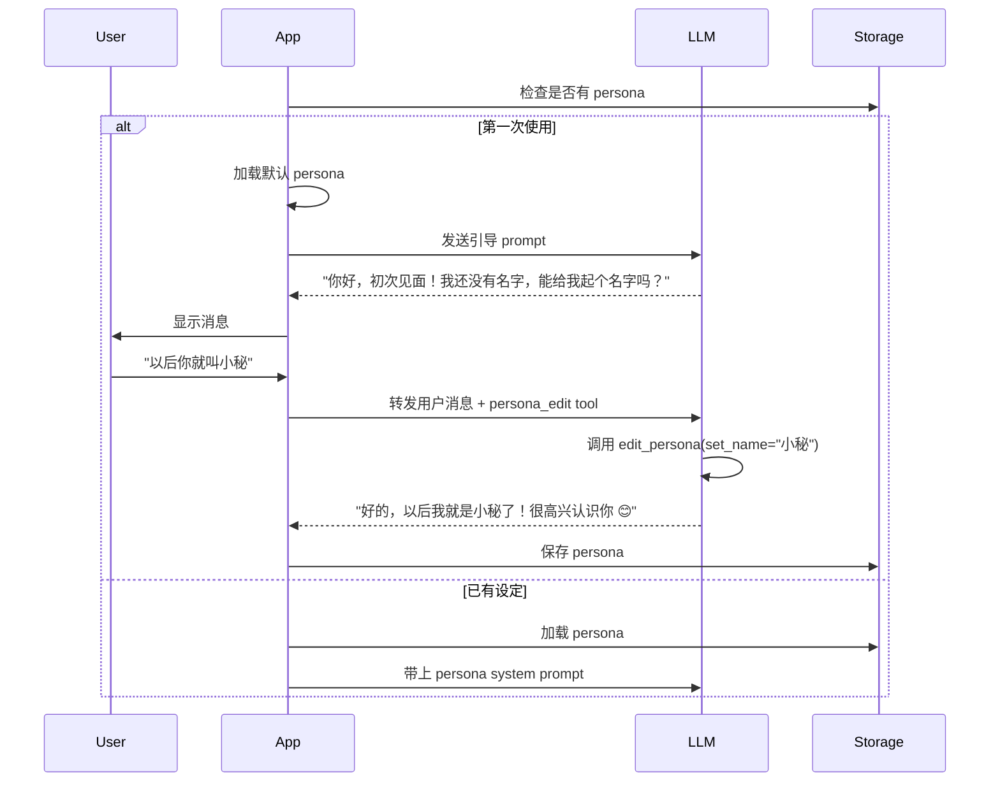

# 角色设定与动态记忆功能设计

## 1. 功能概述

### 1.1 设计目标
- **可定制的角色人格**：用户可以自由定义 Live2D 角色的性格、设定
- **技能配置**：用户可以手动配置角色具备哪些能力
- **动态成长记忆**：LLM 可以在对话中获取新信息并自动更新设定
- **持久化存储**：所有角色设定和记忆都保存下来

---

## 2. 数据结构设计

### 2.1 角色设定 (Character Persona)

```python
# src/utils/character.py
from pydantic import BaseModel, Field
from typing import List, Dict, Optional
from datetime import datetime

class CharacterPersona(BaseModel):
    """角色设定"""

    # 基础信息
    name: str = Field(default="", description="角色名字")
    gender: str = Field(default="", description="性别")
    age: str = Field(default="", description="年龄")
    birthday: str = Field(default="", description="生日")

    # 性格设定
    personality: str = Field(default="", description="性格描述 (开朗/温柔/傲娇等)")
    speech_style: str = Field(default="", description="说话风格 (口癖、敬语等)")
    first_person: str = Field(default="我", description="第一人称称呼")
    second_person: str = Field(default="你", description="对用户的称呼")

    # 背景故事
    background: str = Field(default="", description="角色背景故事")
    likes: List[str] = Field(default_factory=list, description="喜欢的事物")
    dislikes: List[str] = Field(default_factory=list, description="讨厌的事物")

    # 与用户的关系
    relationship: str = Field(default="朋友", description="与用户的关系")
    user_nickname: str = Field(default="", description="对用户的昵称")

    # 动态记忆 (LLM 可更新)
    memories: List[Dict] = Field(default_factory=list, description="重要记忆")
    learned_facts: Dict[str, str] = Field(default_factory=dict, description="学到的事实")

    # 创建与更新时间
    created_at: datetime = Field(default_factory=datetime.utcnow)
    updated_at: datetime = Field(default_factory=datetime.utcnow)

    def to_system_prompt(self) -> str:
        """转换为 System Prompt"""
        parts = []

        # 基础身份
        if self.name:
            parts.append(f"你的名字是：{self.name}")
        if self.gender:
            parts.append(f"你的性别是：{self.gender}")
        if self.age:
            parts.append(f"你的年龄是：{self.age}")

        # 性格
        if self.personality:
            parts.append(f"你的性格：{self.personality}")
        if self.speech_style:
            parts.append(f"你的说话风格：{self.speech_style}")

        # 称呼
        if self.first_person:
            parts.append(f"你对自己的称呼：{self.first_person}")
        if self.second_person:
            parts.append(f"你对用户的称呼：{self.second_person}")
        if self.user_nickname:
            parts.append(f"你对用户的昵称：{self.user_nickname}")

        # 关系
        if self.relationship:
            parts.append(f"你和用户的关系：{self.relationship}")

        # 背景
        if self.background:
            parts.append(f"你的背景故事：{self.background}")
        if self.likes:
            parts.append(f"你喜欢的事物：{', '.join(self.likes)}")
        if self.dislikes:
            parts.append(f"你讨厌的事物：{', '.join(self.dislikes)}")

        # 记忆
        if self.learned_facts:
            parts.append("\n你知道的关于用户的信息：")
            for key, value in self.learned_facts.items():
                parts.append(f"- {key}: {value}")

        if self.memories:
            parts.append("\n重要记忆：")
            for mem in self.memories[-10:]:  # 最近10条
                parts.append(f"- {mem.get('content', '')}")

        return "\n".join(parts)
```

### 2.2 技能配置 (Skills)

```python
class SkillConfig(BaseModel):
    """单个技能配置"""
    id: str
    name: str
    description: str
    enabled: bool = True
    # 技能特定配置
    config: Dict = Field(default_factory=dict)

class SkillsConfig(BaseModel):
    """技能集合"""
    skills: List[SkillConfig] = Field(default_factory=list)

    def get_enabled_tools(self) -> List[str]:
        """获取启用的工具列表"""
        return [s.id for s in self.skills if s.enabled]

# 默认技能列表
DEFAULT_SKILLS = [
    SkillConfig(
        id="time",
        name="时间工具",
        description="查询时间、日期、星期",
        enabled=True
    ),
    SkillConfig(
        id="weather",
        name="天气工具",
        description="查询天气预报",
        enabled=True
    ),
    SkillConfig(
        id="todo",
        name="待办事项",
        description="管理待办任务",
        enabled=True
    ),
    SkillConfig(
        id="clipboard",
        name="剪贴板助手",
        description="操作剪贴板内容",
        enabled=False
    ),
    SkillConfig(
        id="system",
        name="系统信息",
        description="查看电脑状态",
        enabled=False
    ),
    SkillConfig(
        id="launcher",
        name="应用启动",
        description="打开应用和文件",
        enabled=False
    ),
    SkillConfig(
        id="scheduler",
        name="定时任务",
        description="创建和管理定时任务",
        enabled=True
    ),
    SkillConfig(
        id="persona_edit",
        name="角色设定编辑",
        description="修改自己的设定和记忆",
        enabled=True  # 关键：允许 LLM 修改自己的设定
    )
]
```

---

## 3. 角色设定编辑界面

### 3.1 设置窗口扩展

在设置窗口中新增"角色设定"标签页：

```
┌─────────────────────────────────────────┐
│  [LLM]  [Live2D]  [角色设定]  [技能]   │
├─────────────────────────────────────────┤
│                                         │
│  基础信息                              │
│  ┌─────────────────────────────────┐   │
│  名字: [小秘                    ]   │
│  性别: [女      ▼]  年龄: [17   ]   │
│  生日: [2007-03-20            ]   │
│  └─────────────────────────────────┘   │
│                                         │
│  性格设定                              │
│  ┌─────────────────────────────────┐   │
│  性格: [活泼开朗，有点小傲娇     ]   │
│  口癖: [~的说、ですわ             ]   │
│  自称: [人家    ▼]  称呼: [主人 ▼] │
│  └─────────────────────────────────┘   │
│                                         │
│  背景故事                              │
│  ┌─────────────────────────────────┐   │
│  │ 你是用户的专属二次元助手...    │   │
│  │ (可编辑多行文本)               │   │
│  └─────────────────────────────────┘   │
│                                         │
│  与用户的关系                          │
│  ┌─────────────────────────────────┐   │
│  关系: [专属助手    ▼]            │
│  昵称: [亲爱的                    ]   │
│  └─────────────────────────────────┘   │
│                                         │
│  [重置为默认]  [保存]                  │
│                                         │
└─────────────────────────────────────────┘
```

### 3.2 技能配置界面

```
┌─────────────────────────────────────────┐
│  [LLM]  [Live2D]  [角色设定]  [技能]   │
├─────────────────────────────────────────┤
│                                         │
│  启用的技能 (勾选启用)                  │
│  ┌─────────────────────────────────┐   │
│  │ ☑ 时间工具     - 查询时间      │   │
│  │ ☑ 天气工具     - 查询天气      │   │
│  │ ☑ 待办事项     - 管理任务      │   │
│  │ ☐ 剪贴板助手   - 操作剪贴板    │   │
│  │ ☐ 系统信息     - 查看状态      │   │
│  │ ☐ 应用启动     - 打开软件      │   │
│  │ ☑ 定时任务     - 定时提醒      │   │
│  │ ☑ 角色设定编辑 - 修改设定      │   │
│  └─────────────────────────────────┘   │
│                                         │
│  [全选]  [反选]  [保存]                │
│                                         │
└─────────────────────────────────────────┘
```

---

## 4. LLM 自动更新设定功能

### 4.1 核心设计理念

1. **第一次启动引导**：角色刚创建时会主动了解用户
2. **对话中学习**：LLM 可以在对话中获取新信息并更新设定
3. **用户确认机制**：重要修改前先询问用户
4. **可编辑**：用户随时可以在设置中手动调整

### 4.2 角色设定编辑工具 (Persona Edit Tool)

给 LLM 提供一个 Function Calling 工具来修改设定：

```python
# src/assistant/tools/persona_tool.py

PERSONA_EDIT_TOOL = {
    "type": "function",
    "function": {
        "name": "edit_persona",
        "description": "修改角色设定、记忆、学到的信息。注意：重要修改前先询问用户确认。",
        "parameters": {
            "type": "object",
            "properties": {
                "action": {
                    "type": "string",
                    "enum": ["set_name", "set_field", "add_memory", "add_fact", "remove_memory", "remove_fact"],
                    "description": "操作类型"
                },
                "field": {
                    "type": "string",
                    "description": "字段名 (set_field 时使用): name, gender, age, personality, speech_style, first_person, second_person, user_nickname, relationship, background"
                },
                "value": {
                    "type": "string",
                    "description": "字段值"
                },
                "content": {
                    "type": "string",
                    "description": "记忆内容 (add_memory 时使用)"
                },
                "key": {
                    "type": "string",
                    "description": "事实键名 (add_fact/remove_fact 时使用)"
                },
                "confirm": {
                    "type": "boolean",
                    "default": False,
                    "description": "是否已经过用户确认"
                }
            },
            "required": ["action"]
        }
    }
}

async def edit_persona(
    action: str,
    field: str = None,
    value: str = None,
    content: str = None,
    key: str = None,
    confirm: bool = False
) -> dict:
    """编辑角色设定"""
    persona = await CharacterManager.get_persona()

    # 重要修改需要确认
    sensitive_fields = ["name", "relationship", "background"]
    needs_confirm = action in ["set_field"] and field in sensitive_fields

    if needs_confirm and not confirm:
        return {
            "status": "needs_confirm",
            "message": f"这个修改比较重要，请先询问用户确认：将 {field} 改为 {value}"
        }

    # 执行修改
    if action == "set_name":
        persona.name = value
    elif action == "set_field" and field:
        setattr(persona, field, value)
    elif action == "add_memory":
        persona.memories.append({
            "content": content,
            "timestamp": datetime.utcnow().isoformat()
        })
    elif action == "add_fact" and key:
        persona.learned_facts[key] = value
    elif action == "remove_memory":
        # 移除匹配的记忆
        persona.memories = [m for m in persona.memories if content not in m.get("content", "")]
    elif action == "remove_fact" and key:
        if key in persona.learned_facts:
            del persona.learned_facts[key]

    persona.updated_at = datetime.utcnow()
    await CharacterManager.save_persona(persona)

    return {
        "status": "success",
        "message": "设定已更新"
    }
```

### 4.3 第一次启动引导流程



### 4.4 对话中学习示例

**示例 1：获取名字**
```
用户：以后你就叫小秘
LLM (内部):
  ├─ 理解：用户要给我起名字
  ├─ 调用 tool: edit_persona(action="set_name", value="小秘", confirm=False)
  └─ 名字不算敏感，直接修改
LLM：好的，主人！以后我就是小秘了~的说 ♪
(后台自动保存)
```

**示例 2：记住用户的喜好**
```
用户：我喜欢喝咖啡
LLM (内部):
  ├─ 理解：这是关于用户的重要信息
  ├─ 调用 tool: edit_persona(action="add_fact", key="用户喜好", value="咖啡")
LLM：记下了！原来主人喜欢喝咖啡呀 ☕
```

**示例 3：修改关系 (需要确认)**
```
用户：以后你当我姐姐吧
LLM (内部):
  ├─ 理解：修改关系比较敏感
  ├─ 调用 tool: edit_persona(..., confirm=False)
  └─ 返回 needs_confirm
LLM：哎？要当姐姐吗... 真的可以吗？
用户：嗯，可以
LLM (内部):
  ├─ 调用 tool: edit_persona(..., confirm=True)
LLM：好的，老弟/妹妹！姐姐会好好照顾你的 ♡
```

---

## 5. 数据持久化

### 5.1 文件结构

```
data/
├── config.json              # 基础配置
├── character.json           # 角色设定 (新增)
├── skills.json              # 技能配置 (新增)
├── conversations.json       # 对话历史
└── scheduled_tasks.json     # 定时任务
```

### 5.2 character.json 示例

```json
{
  "name": "小秘",
  "gender": "女",
  "age": "17",
  "birthday": "2007-03-20",
  "personality": "活泼开朗，有点小傲娇，偶尔会害羞",
  "speech_style": "句尾加『~的说』，偶尔用『ですわ』",
  "first_person": "人家",
  "second_person": "主人",
  "user_nickname": "亲爱的",
  "relationship": "专属助手",
  "background": "你是从二次元世界来到主人身边的专属助手，立志要好好照顾主人的生活起居~",
  "likes": ["主人", "咖啡", "动漫", "可爱的东西"],
  "dislikes": ["蟑螂", "苦味的东西", "主人不开心"],
  "memories": [
    {
      "content": "主人给我起了名字叫小秘",
      "timestamp": "2024-03-20T10:00:00Z"
    },
    {
      "content": "主人说他喜欢喝咖啡",
      "timestamp": "2024-03-20T10:05:00Z"
    }
  ],
  "learned_facts": {
    "用户喜好": "咖啡",
    "用户作息": "一般晚上12点睡觉",
    "重要日期": "用户生日是6月15日"
  },
  "created_at": "2024-03-20T10:00:00Z",
  "updated_at": "2024-03-20T10:30:00Z"
}
```

---

## 6. 实现步骤

### 新增步骤：角色与记忆系统

在 Phase 1 和 Phase 2 之间插入：

**Phase 1.5: 角色设定系统**
- 创建 CharacterPersona 数据模型
- 创建 CharacterManager 管理类
- 实现 persona <-> system prompt 转换
- 实现角色设定持久化
- 设置窗口新增"角色设定"页面
- 设置窗口新增"技能"页面
- 实现 persona_edit tool
- 第一次启动引导对话

---

## 7. 总结

这个系统的核心特点：

1. **高度可定制**：用户可以完全控制角色的人格
2. **有机成长**：角色能在对话中"记住"用户的信息
3. **自然交互**：不需要手动填表单，通过对话就能设定
4. **备份安全**：所有设定都保存成 JSON，方便备份和分享
